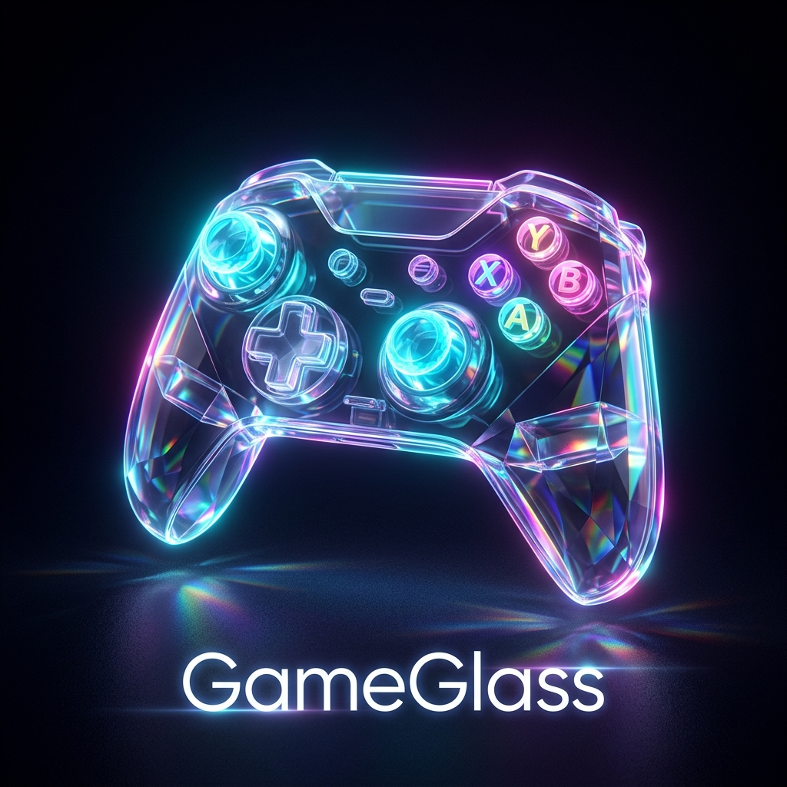

<div align="center">
  
  <h1>🎮 GameGlass Portal</h1>
  <p><strong>Univerzální školní Game Jam platforma pro běh (zatím) Python her přímo v prohlížeči.</strong></p>
  
  [](https://react.dev/)
  [](https://appwrite.io/)
  [](https://pyodide.org/)
</div>

---

## 📝 O projektu

**GameGlass** je open-source webová platforma navržená speciálně pro učitele informatiky a pořádání školních Game Jamů. Vznikla jako rychlý **Proof-of-Concept** (z větší části vytvořená metodou *vibecodingu* s AI), s cílem zábavnou a interaktivní formou demonstrovat studentské práce.

Místo toho, aby si učitelé nebo spolužáci museli stahovat desítky `.zip` souborů, instalovat Python, řešit chybějící knihovny a verze, **GameGlass spouští všechny hry magicky a izolovaně přímo ve webovém prohlížeči!**

## ✨ Klíčové funkce

- **🕹️ Podpora Pygame:** Grafické a 2D hry napsané v knihovně Pygame běží v prohlížeči plynule přes nativní WebAssembly engine (Pygbag). Zvuky i ovládání plně podporováno.
- **📖 Vizuální novely (Ren'Py):** Portál obsahuje vestavěný Ren'Py Web emulátor. Studentům stačí zazipovat složku `game/` a portál si aplikaci za běhu sám zkompiluje.
- **💻 Čistý Python (Terminálové hry):** Skripty a textovky běží v izolovaném WebWorkeru (Pyodide), doplněné o luxusní HTML/CSS terminálové rozhraní bez zasekávání prohlížeče.
- **☁️ Backend na Appwrite:** Jednoduché, robustní a self-hosted řešení pro nahrávání her a ukládání `.zip` balíčků přes Appwrite Storage.
- **🚀 One-click Upload:** Intuitivní rozhraní pro nahrávání projektů, které zkontroluje správné zabalení hry a navede studenta krok za krokem.

## 🛠️ Architektura a technologie

- **Frontend:** React + Vite + Tailwind CSS
- **Backend:** Appwrite (Databáze + Storage)
- **Enginy:** 
  - `pyodide` (pro čistý Python 3.12)
  - `pygbag` (WebAssembly port pro Pygame)
  - `Ren'Py Web` (Emscripten port)

> *Poznámka: Aplikace je plně koncipována k lokálnímu nasazení ve školních sítích (např. na Proxmox serveru).*

## 📚 Dokumentace a Návody

V kořenovém adresáři repozitáře naleznete podrobné návody pro učitele a správce sítě:

- 📖 [**Návod k instalaci (first_install.md)**](first_install.md) - Kompletní postup nasazení Appwrite a Frontendu (např. na Proxmox pomocí Dockeru), včetně pravidel pro studenty.
- 📦 [**Jak vydávat verze (how_to_release.md)**](how_to_release.md) - Návod, jak na GitHubu tvořit nové Releases.
- 🔄 **Automatický Updater (`update.sh`)** - Připravený skript pro produkční servery, který jedním příkazem stáhne novou verzi z GitHubu a restartuje Docker kontejnery.

## 📦 Jak spustit lokálně pro vývoj

1. Naklonujte repozitář:
   ```bash
   git clone https://github.com/vzor/gameglass.git
   cd gameglass/webapp
   ```

2. Nainstalujte závislosti:
   ```bash
   npm install
   ```

3. Vytvořte `.env` soubor v adresáři `webapp/` a nastavte Appwrite údaje:
   ```env
   VITE_APPWRITE_ENDPOINT=http://vase-ip/v1
   VITE_APPWRITE_PROJECT_ID=vas_project_id
   ```

4. Spusťte vývojový server:
   ```bash
   npm run dev
   ```

## 🗺️ Budoucí Roadmapa

I když je aktuální verze plně funkční pro rychlé Game Jamy, máme v plánu aplikaci nadále rozšiřovat:

- [ ] **Systém uživatelských účtů:** Integrace Appwrite Auth pro přihlašování studentů přes školní e-maily.
- [ ] **Administrátorský a hodnotící panel:** Tvorba rolí (Student, Admin, Porotce) pro bezpečné mazání a oficiální bodování/schvalování her porotou.
- [ ] **Vícejazyčnost (i18n):** Přidání přepínače jazyků s podporou lokalizace (CZ, SK, EN, DE).

---

*Tento projekt byl s láskou (a trochou umělé inteligence) navržen pro všechny učitele, kteří chtějí studentům usnadnit sdílení jejich první radosti z programování.*
